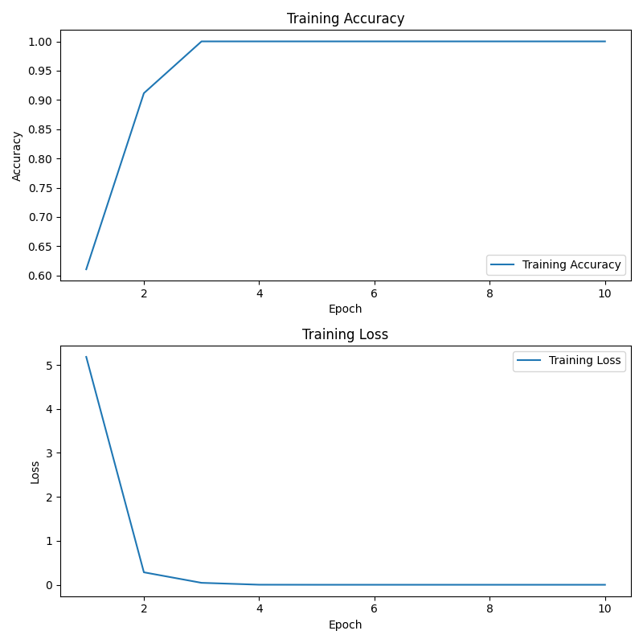
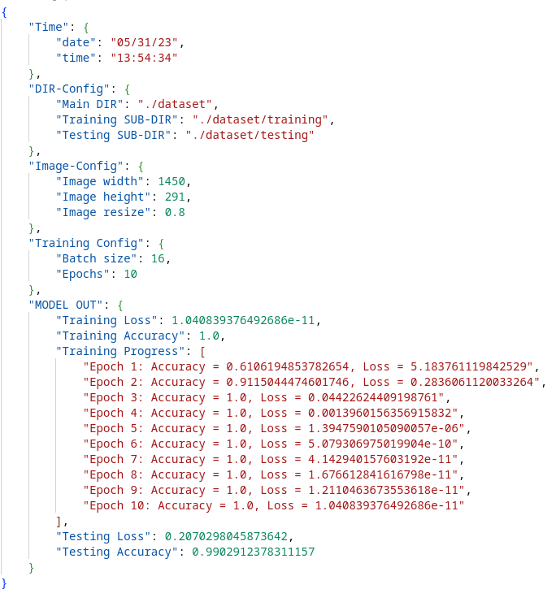

# :bar_chart: Zabbix Graphs Bottleneck Classification :mag_right:

The :bar_chart:**zabbix-graphs-bottleneck-classification** project aims to automate the identification and classification of bottlenecks using graphs from Zabbix. :computer: By leveraging the Zabbix API, the project connects to the Zabbix server and downloads the graph images corresponding to specific item IDs. These graph images are then used to train a machine learning model for bottleneck classification. :chart_with_upwards_trend:

## :sparkles: **Key Features**:

-   :gear: Zabbix Integration: Connects to the Zabbix server using API authentication to access the required graph images.
-   :camera: Graph Image Extraction: Downloads graph images from Zabbix based on the provided item IDs.
-   :robot: Machine Learning Model Training: Utilizes TensorFlow to train a deep learning model using the downloaded graph images.
-   :mag: Bottleneck Classification: Applies the trained model to identify and classify bottlenecks in the system.
-   :rocket: Automation and Efficiency: Automates the process of obtaining graph images and performing bottleneck classification, enabling efficient monitoring and analysis.

This project serves as a practical solution for system administrators and IT professionals to proactively identify and address bottlenecks in their infrastructure using Zabbix's monitoring capabilities and machine learning techniques.

### :computer: Tested Platforms

-   Linux (Tested ✔️)
-   Windows (Not Tested ❌)
-   MacOS (Not Tested ❌)

## :link: Dependencies

To run this project, you need to have the following dependencies installed:

-   🐍 [Python >= 3.8](https://www.python.org/downloads/): Python is a programming language used by this project.
-   📦 [pip](https://pip.pypa.io/en/stable/): pip is the package installer for Python.
-   🤖 [TensorFlow](https://www.tensorflow.org/): TensorFlow is a machine learning framework used for model training.
-   🌐 [requests](https://pypi.org/project/requests/): requests is a Python library used for making HTTP requests.
-   📊 [matplotlib](https://matplotlib.org/): matplotlib is a Python plotting library used for visualizations.

## :inbox_tray: Installation

##### Debian-based (e.g., Ubuntu, Debian):

```shell
# Update package information
sudo apt update

# Install Python
sudo apt install python3

# Install pip
sudo apt install python3-pip

# Update pip
python3 -m pip install --upgrade pip

# Install TensorFlow
pip3 install tensorflow

# Install requests
pip3 install requests

# Install matplotlib
pip3 install matplotlib
```

##### RPM-based (e.g., Fedora, CentOS, Red Hat Enterprise Linux):

```shell
# Update system packages
sudo dnf update

# Install Python
sudo dnf install python3

# Install pip
sudo dnf install python3-pip

# Update pip
python3 -m pip install --upgrade pip

# Install TensorFlow
pip3 install tensorflow

# Install requests
pip3 install requests

# Install matplotlib
pip3 install matplotlib
```

##### Windows

1. **Python**: Download and install the latest Python version from the official website for Windows.

2. **pip**: Verify if pip is installed by running `pip --version` in a command prompt. If not, upgrade it with `python -m ensurepip --upgrade`.

3. Install TensorFlow, requests, matplotlib using:

```shell
    pip install tensorflow
    pip install requests
    pip install matplotlib
```
🛠️ ⚠️ Troubleshooting: If you encounter any errors during the installation process, it is recommended to refer to the official website for the installation manual specific to your system.  

## :hammer_and_wrench: Usage

Clone the project to your folder.

#### 1. 📊 Zabbix Graphs Data Collection

To begin collecting data from Zabbix graphs periodically, follow these steps:

1. Configure the **[zabbix_conf.json](./zabbix_conf.json)** file:

    In the **[zabbix_conf.json](./zabbix_conf.json)** file in [*"Data Collection"*]() section, specify the following parameters:

    ```json
    "Data Collection": {
        "COMPANY_DOMAIN_NAME": "",
        "USERNAME": "",
        "PASSWORD": "",
        "IMAGE_DIRECTORY": "./images",
        "REQUESTS_PER_HOUR": 1800
    },
    ```

    Replace the values with your actual credentials and desired settings:
    |Parameter|Definition|
    |---------------------|-----------------------------------------------------------------------------------------|
    |🏢 COMPANY_DOMAIN_NAME| Your Zabbix server domain name (e.g., monitoring.example.com or statistics.example.com).|
    |👤 USERNAME | Your Zabbix account username.|
    |🔒 PASSWORD | Your Zabbix account password.|
    |🖼️ IMAGE_DIRECTORY | The path to the directory where you want to save the downloaded images (e.g., `./images` or `screens` or `data/`), default is `./images`.|
    |🕒 REQUESTS_PER_HOUR | The number of requests per hour to make to the Zabbix server (e.g., if equals to 4, the requests will be sent every 15 min (as 60 min/4)).|

---

2. Configure the **[graphs.csv](./graphs.csv)** file:

    In the **[graphs.csv](./graphs.csv)** file, specify the graphs you want to pull images from. Each line should follow the format:

    ```php
    <interface_name>,<item_id>
    # no spaces
    ```

    Here's an example of the **[graphs.csv](./graphs.csv)** file:

    ```csv
    Interface Number 1,263947
    Interface Number 2,2623413949
    Interface Number 3,2943124410
    Interface Number 4,265323961
    Interface Number 5,2953250400
    ```

    Replace the example entries with the actual interface names and corresponding item IDs from your Zabbix server.

---

3. Run **[get_data.py](./get_data.py)** to start data collection by: 

> python3 get_data.py

On the server where you want to collect the Zabbix graph images, execute the get_data.py script. This script will connect to the Zabbix server, download the graph images based on the specified interfaces and item IDs, and save them to the specified directory.

#### 2. 📷Image Classification and Folder Structuring
By organizing the images into the specified folder structure, you will have separate directories for training and testing, with subfolders for bottleneck and non-bottleneck images. This structure will facilitate the subsequent steps of your project, such as model training and evaluation.

It involves classifying the collected images into specific folders. 

By default, the directory structure of [dataset](./dataset/) for the images is set as follows:

```shell
dataset
├── training
│   ├── bottleneck
│   │   └── [bottleneck images]
│   └── not_bottleneck
│       └── [non-bottleneck images]
└── testing
    ├── bottleneck
    │   └── [bottleneck images]
    └── not_bottleneck
        └── [non-bottleneck images]
```
> #### :warning: DO NOT change the any folder structure or folder names.


To classify the images into the appropriate folders:

- Move or copy the collected images from *IMAGE_DIRECTORY* (default is `./images`) into the appropriate folders based on their classification.
        
    - 📁Bottleneck images should be placed in the [bottleneck]() folders within the [training](./dataset/training/) and [testing](./dataset/testing/) directories.
        
    - 📁Non-bottleneck images should be placed in the [not_bottleneck]() folders within the [training](./dataset/training/) and [testing](./dataset/testing/) directories.


:red_circle: Ensure that the images are correctly classified and placed in the respective folders according to their classification (bottleneck or non-bottleneck).

#### 3. :rocket:Model Training
By following these steps, you will be able to 🏋️‍♀️ run the training process, 💾 save the trained model, and 📊 access relevant logs for reference.

To initiate the model training process, you have **two options**:

**1.** Execute **[main.py](main.py)**.
This is the straightforward method; simply run the file and wait for the training to complete.

OR

**2.** If you prefer a more readable format for reviewing the code, follow these steps: 
1. 📝Open the **[main.ipynb](./main.ipynb)** notebook.

2. ▶️Run all the cells in the notebook by selecting *"Run All"* from the *"Run"* menu or by clicking the appropriate button in your notebook interface.

⏳If there are no errors during execution, the model training process will begin. As the training progresses, you will be able to monitor the logs and receive information about the overall process.

💾Once the training is completed, the trained model will be automatically saved to the **MK-1** folder. You can locate the saved model in this folder.

📋 Additionally, detailed logs about the training process, as well as information about the overall process, can be found in the **[logs/zabbix_logs.json](./logs/zabbix_logs.json)** file. Default log directory is **[./logs](./logs/)**, however it can be changed (read about it in [customization section](#art-customization))


## :art: Customization

In the **[zabbix_conf.json](./zabbix_conf.json)** file, in [*"Model Training"*]() section, you have the flexibility to customize various parameters to tailor the image classification and model training process according to your specific requirements. These parameters allow you to control aspects such as *directory paths*, *image settings*, *batch size*, *class names*, *training epochs*.


By adjusting these parameters, you can adapt the project to different datasets, image dimensions, training preference.

```json

"Model Training": {

        "main_dir": "./dataset",
        "train_dir": "./dataset/training",
        "test_dir": "./dataset/testing",
        "logs_dir": "./logs",

        "image_width": 1450,
        "image_height": 291,
        "resize_factor": 0.8,

        "batch_size": 16,
        "class_names": [ "bottleneck", "non_bottleneck" ],
        "epochs": 10
    }

```

Feel free to modify these parameters based on your needs and preferences to achieve optimal results.:rocket: 

1. Directory Paths:
    + **main_dir**: Specifies the path to the main directory that contains the training and testing folders.
    + **train_dir**: Defines the subdirectory within the main directory for training data.
    + **test_dir**: Determines the subdirectory within the main directory for testing data.
    + **logs_dir**: Specifies the path to the log directory.

2. Image Settings:
    + **image_width**: Sets the desired width for the images in pixels.
    + **image_height**: Sets the desired height for the images in pixels.
    + **resize_factor**: Controls the percentage by which the photo size is reduced (e.g., 0.8 reduces the size by 20%).

3. Batch Size:
    + **batch_size**: Specifies the number of images to include in each training batch. Adjusting this parameter can impact the training speed and memory consumption.

4. Class Names:
    + **class_names**: Provides the exact names of the two classes (directories) present in both the training and testing subdirectories. Ensure that these names correspond correctly to your dataset. (By default they are "bottleneck" and "non_bottleneck". It is NOT Recommended to change their names)

5. Training Epochs:
    + **epochs**: Determines the number of training epochs, which represent the number of times the model will iterate over the entire training dataset.

## Examples:
After succesfull training you can view newly created logs:
A training plot image:
> **logs / training_plot.png** :



And an overall properties of the model:

> **logs / zabbix_logs.json** :



## :page_with_curl: Code Description:
> Script **[get_data.py](./get_data.py)** : 📜

This code is used to collect images from a Zabbix monitoring system. It connects to the Zabbix API, authenticates the user, and downloads images corresponding to specified item IDs. The collected images are saved to a specified directory.

Here is a breakdown of the code:

1. The code starts by importing the necessary libraries and modules: requests, json, datetime, time, os, csv.
2. It reads the configuration file zabbix_conf.json to get the required parameters such as the company domain name, username, password, image directory, and requests per hour.
3. It checks if the specified image directory exists and creates it if it doesn't.
4. It sets the request configurations, including the URL and headers for making API requests.
5. It reads a CSV file named graphs.csv which contains interface names and their corresponding item IDs. It populates a dictionary (item_dict) with this data.
6. The current_time function returns the current timestamp in the desired format.
7. The authenticate_user function sends an API request to authenticate the user using the provided credentials. It retrieves and returns the session token required for subsequent requests.
8. The download_images function loops through the item IDs and constructs the image URL for each item. It sends a request to download the image, saves it to the specified image directory with a filename containing the timestamp and a file counter, and prints a success message.
9. The logout_user function sends a request to log out the user from the Zabbix system.
10. The main function is the entry point of the code. It runs in an infinite loop, authenticates the user, downloads images, logs out the user, and then waits for a specific interval defined by the requests per hour parameter.
11. Finally, the main function is called if the script is executed directly.

This code can be used as a standalone script to automate the collection of images from a Zabbix monitoring system at regular intervals. It can be further modified to add additional functionalities or integrated into a larger project.

---
> Script **[main.ipynb](./main.ipynb)** / **[main.py](./main.py)** : 📜


This code trains a machine learning model for image classification using TensorFlow and Keras. It follows the following steps:

This code is for training a convolutional neural network (CNN) model using TensorFlow and Keras. Here is a description of the code:

1. The necessary libraries and modules are imported, including TensorFlow, Keras, Matplotlib, and JSON.

2. Customization:
   - The code reads a JSON configuration file named "zabbix_conf.json" and retrieves the required settings for model training from [*"Model Training"*]() section.
   - The main directory, training directory, testing directory, logs directory, image dimensions, resize factor, batch size, class names, and number of epochs are defined based on the configuration file.
   - Information about the chosen settings is printed to the console.

3. Creating the datasets:
   - The code creates the training and testing datasets using the `tf.keras.preprocessing.image_dataset_from_directory()` function.
   - The datasets are set up with the appropriate settings, such as labels, color mode, batch size, and image size.
   - The pixel values of the images in the datasets are normalized to a range of [0, 1] using the `map()` method.

4. Image resizing:
   - The code resizes the images in the datasets based on the specified resize factor using the `tf.image.resize()` function.

5. Model creation:
   - A sequential model is created using the `Sequential()` class from Keras.
   - Convolutional, pooling, and dense layers are added to the model.
   - The model is compiled with the Adam optimizer, binary cross-entropy loss function, and accuracy as the evaluation metric.

6. Model training:
   - The model is trained using the `fit()` method with the training dataset for the specified number of epochs and batch size.
   - The training progress is stored in the `history` object.

7. Model evaluation:
   - The trained model is evaluated on the test dataset using the `evaluate()` method, and the testing loss and accuracy are obtained.

8. Plotting the training progress:
   - The training accuracy and loss values from the `history` object are plotted using Matplotlib.
   - Two subplots are created for accuracy and loss, and the plots are saved as a figure in default log directory.

9. Logging and saving:
   - Various information and metrics, including timestamps, directory configurations, image settings, training configurations, and model performance, are stored in a dictionary called `logs`.
   - The `logs` dictionary is written to a JSON file named "zabbix_logs.json" in the specified logs directory.
   - The trained model is saved to a file named "MK-1" in the current directory.

This code essentially sets up a CNN model, trains it on the provided datasets, evaluates its performance, saves the model, and logs relevant information about the training process.
Overall, this script serves as a foundation for training and evaluating an image classification model using TensorFlow and Keras. With further customization and expansion, it can be adapted to various image classification tasks and integrated into larger machine learning projects.

## :raising_hand: Contributing

🙌 Contributions to this project are welcome! If you have any ideas, improvements, or bug fixes, please submit a pull request 🛠️. For major changes, please open an issue to discuss your ideas beforehand 💡.

## :scroll: License

This project is licensed under the MIT License 📜.

## :pray: Acknowledgments
I would like to express my gratitude to the following libraries and frameworks for their valuable contributions to this project:
- TensorFlow: for providing powerful tools and resources for deep learning and neural network training.
- Matplotlib: for enabling the visualization and plotting of data in a clear and intuitive manner.

Their dedication to open-source development and continuous improvement has greatly facilitated the creation of this project.
